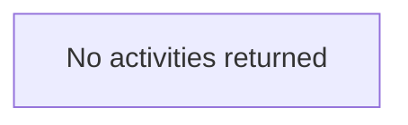

# Pipelines overview - Synapse workspace `ngmomis-prod`

_Read-only export. One section per pipeline: short summary, **Mermaid** dependency flow, then parameters, variables, and activity details._

**Generated (UTC):** 2026-03-20 14:31:48 UTC

---

## ADLS_to_DB

### Summary
Pipeline `ADLS_to_DB` has no top-level activities in the fetched definition (check JSON or Studio).

### Flow (dependencies)



_Arrows follow `dependsOn`: upstream runs before downstream. `START` is a synthetic entry for activities with no dependencies. External or missing upstream names appear as `ext: ...`._

### Details

_No pipeline parameters._

---

## AzureSQLMaintenance

### Summary
Pipeline `AzureSQLMaintenance` has no top-level activities in the fetched definition (check JSON or Studio).

### Flow (dependencies)


_Arrows follow `dependsOn`: upstream runs before downstream. `START` is a synthetic entry for activities with no dependencies. External or missing upstream names appear as `ext: ...`._

### Details

_No pipeline parameters._

---

## BI_EXECUTE_PIPELINE

### Summary
Pipeline `BI_EXECUTE_PIPELINE` has no top-level activities in the fetched definition (check JSON or Studio).

### Flow (dependencies)


_Arrows follow `dependsOn`: upstream runs before downstream. `START` is a synthetic entry for activities with no dependencies. External or missing upstream names appear as `ext: ...`._

### Details

_No pipeline parameters._

---

## BI_MAIN_PIPELINE

### Summary
Pipeline `BI_MAIN_PIPELINE` has no top-level activities in the fetched definition (check JSON or Studio).

### Flow (dependencies)


_Arrows follow `dependsOn`: upstream runs before downstream. `START` is a synthetic entry for activities with no dependencies. External or missing upstream names appear as `ext: ...`._

### Details

_No pipeline parameters._

---

## DB_Scale Calender

### Summary
Pipeline `DB_Scale Calender` has no top-level activities in the fetched definition (check JSON or Studio).

### Flow (dependencies)


_Arrows follow `dependsOn`: upstream runs before downstream. `START` is a synthetic entry for activities with no dependencies. External or missing upstream names appear as `ext: ...`._

### Details

_No pipeline parameters._

---

## DB_Scale Status Pipe

### Summary
Pipeline `DB_Scale Status Pipe` has no top-level activities in the fetched definition (check JSON or Studio).

### Flow (dependencies)


_Arrows follow `dependsOn`: upstream runs before downstream. `START` is a synthetic entry for activities with no dependencies. External or missing upstream names appear as `ext: ...`._

### Details

_No pipeline parameters._

---

## error_handling

### Summary
Pipeline `error_handling` has no top-level activities in the fetched definition (check JSON or Studio).

### Flow (dependencies)


_Arrows follow `dependsOn`: upstream runs before downstream. `START` is a synthetic entry for activities with no dependencies. External or missing upstream names appear as `ext: ...`._

### Details

_No pipeline parameters._

---

## HOUSEKEEPING_PG

### Summary
Pipeline `HOUSEKEEPING_PG` has no top-level activities in the fetched definition (check JSON or Studio).

### Flow (dependencies)


_Arrows follow `dependsOn`: upstream runs before downstream. `START` is a synthetic entry for activities with no dependencies. External or missing upstream names appear as `ext: ...`._

### Details

_No pipeline parameters._

---

## IMPORT_FS_METADATA

### Summary
Pipeline `IMPORT_FS_METADATA` has no top-level activities in the fetched definition (check JSON or Studio).

### Flow (dependencies)


_Arrows follow `dependsOn`: upstream runs before downstream. `START` is a synthetic entry for activities with no dependencies. External or missing upstream names appear as `ext: ...`._

### Details

_No pipeline parameters._

---

## IMPORT_NBDO_REPORTING

### Summary
Pipeline `IMPORT_NBDO_REPORTING` has no top-level activities in the fetched definition (check JSON or Studio).

### Flow (dependencies)


_Arrows follow `dependsOn`: upstream runs before downstream. `START` is a synthetic entry for activities with no dependencies. External or missing upstream names appear as `ext: ...`._

### Details

_No pipeline parameters._

---

## IMPORT_NIMS_PERSON

### Summary
Pipeline `IMPORT_NIMS_PERSON` has no top-level activities in the fetched definition (check JSON or Studio).

### Flow (dependencies)


_Arrows follow `dependsOn`: upstream runs before downstream. `START` is a synthetic entry for activities with no dependencies. External or missing upstream names appear as `ext: ...`._

### Details

_No pipeline parameters._

---

## KSTACK_EXECUTE_JOBS_PROCEDURE_EXE

### Summary
Pipeline `KSTACK_EXECUTE_JOBS_PROCEDURE_EXE` has no top-level activities in the fetched definition (check JSON or Studio).

### Flow (dependencies)


_Arrows follow `dependsOn`: upstream runs before downstream. `START` is a synthetic entry for activities with no dependencies. External or missing upstream names appear as `ext: ...`._

### Details

_No pipeline parameters._

---

## LOAD_ODS_TO_HIST_KSTACK_SP

### Summary
Pipeline `LOAD_ODS_TO_HIST_KSTACK_SP` has no top-level activities in the fetched definition (check JSON or Studio).

### Flow (dependencies)


_Arrows follow `dependsOn`: upstream runs before downstream. `START` is a synthetic entry for activities with no dependencies. External or missing upstream names appear as `ext: ...`._

### Details

_No pipeline parameters._

---

## MANUAL_AGGREGATION

### Summary
Pipeline `MANUAL_AGGREGATION` has no top-level activities in the fetched definition (check JSON or Studio).

### Flow (dependencies)


_Arrows follow `dependsOn`: upstream runs before downstream. `START` is a synthetic entry for activities with no dependencies. External or missing upstream names appear as `ext: ...`._

### Details

_No pipeline parameters._

---

## metadatavalidation_transpose_master_pl

### Summary
Pipeline `metadatavalidation_transpose_master_pl` has no top-level activities in the fetched definition (check JSON or Studio).

### Flow (dependencies)


_Arrows follow `dependsOn`: upstream runs before downstream. `START` is a synthetic entry for activities with no dependencies. External or missing upstream names appear as `ext: ...`._

### Details

_No pipeline parameters._

---

## metadatavalidation_transpose_mastercopy_2

### Summary
Pipeline `metadatavalidation_transpose_mastercopy_2` has no top-level activities in the fetched definition (check JSON or Studio).

### Flow (dependencies)


_Arrows follow `dependsOn`: upstream runs before downstream. `START` is a synthetic entry for activities with no dependencies. External or missing upstream names appear as `ext: ...`._

### Details

_No pipeline parameters._

---

## nopsfc_pipeline

### Summary
Pipeline `nopsfc_pipeline` has no top-level activities in the fetched definition (check JSON or Studio).

### Flow (dependencies)


_Arrows follow `dependsOn`: upstream runs before downstream. `START` is a synthetic entry for activities with no dependencies. External or missing upstream names appear as `ext: ...`._

### Details

_No pipeline parameters._

---

## oct_uploader_master

### Summary
Pipeline `oct_uploader_master` has no top-level activities in the fetched definition (check JSON or Studio).

### Flow (dependencies)


_Arrows follow `dependsOn`: upstream runs before downstream. `START` is a synthetic entry for activities with no dependencies. External or missing upstream names appear as `ext: ...`._

### Details

_No pipeline parameters._

---

## SESSION_KILLING_JOB

### Summary
Pipeline `SESSION_KILLING_JOB` has no top-level activities in the fetched definition (check JSON or Studio).

### Flow (dependencies)


_Arrows follow `dependsOn`: upstream runs before downstream. `START` is a synthetic entry for activities with no dependencies. External or missing upstream names appear as `ext: ...`._

### Details

_No pipeline parameters._

---

## sharepoint_load_one_pl

### Summary
Pipeline `sharepoint_load_one_pl` has no top-level activities in the fetched definition (check JSON or Studio).

### Flow (dependencies)


_Arrows follow `dependsOn`: upstream runs before downstream. `START` is a synthetic entry for activities with no dependencies. External or missing upstream names appear as `ext: ...`._

### Details

_No pipeline parameters._

---

## UPDATE_AUTO_REP_PERIOD_JOB

### Summary
Pipeline `UPDATE_AUTO_REP_PERIOD_JOB` has no top-level activities in the fetched definition (check JSON or Studio).

### Flow (dependencies)

```mermaid
flowchart TD
    EMPTY["No activities returned"]
```

_Arrows follow `dependsOn`: upstream runs before downstream. `START` is a synthetic entry for activities with no dependencies. External or missing upstream names appear as `ext: ...`._

### Details

_No pipeline parameters._

---

## UPDATE_USER_ACTIVE_FLAG

### Summary
Pipeline `UPDATE_USER_ACTIVE_FLAG` has no top-level activities in the fetched definition (check JSON or Studio).

### Flow (dependencies)

```mermaid
flowchart TD
    EMPTY["No activities returned"]
```

_Arrows follow `dependsOn`: upstream runs before downstream. `START` is a synthetic entry for activities with no dependencies. External or missing upstream names appear as `ext: ...`._

### Details

_No pipeline parameters._

---

